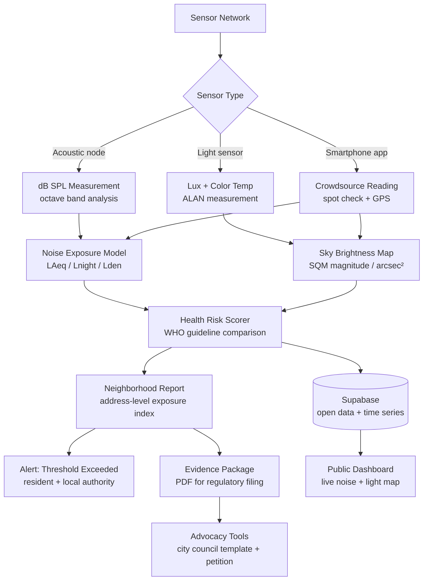

<p align="center">
  <h1 align="center">foundation-quiet-dark</h1>
  <h3 align="center"><em>Community sensor networks detecting the noise and light pollution harming 100 million+ people.</em></h3>
</p>

<p align="center">
  <a href="LICENSE"></a>
  
  
  <a href="https://mama.oliwoods.ai"></a>
  <a href="https://mama.oliwoods.ai/foundation"></a>
</p>

---

> *"More than 100 million people in Europe and the US are exposed to traffic noise at levels linked to sleep disturbance, cardiovascular disease, and cognitive impairment. Artificial light at night has increased 49% globally in 25 years."*
> — WHO Environmental Noise Guidelines, 2018 / Science Advances, 2017

---

## Why This Exists

Noise and light are the most pervasive forms of pollution that no one regulates. They are invisible in official air quality dashboards, largely absent from health risk assessments, and almost completely unmeasured at the neighborhood level.

- **Noise kills.** The WHO estimates noise pollution causes 1.6 million healthy life-years lost annually in Western Europe alone — through sleep disruption, hypertension, heart attacks, and cognitive impairment in children (WHO, 2018).
- **Light at night disrupts physiology.** Artificial light at night (ALAN) suppresses melatonin, disrupts circadian rhythms, and is associated with elevated rates of breast cancer, obesity, and depression (Cho et al., *Chronobiology International*, 2015).
- **Wildlife is collapsing in silence.** Noise pollution causes birds to change their songs or abandon habitat. Light pollution kills 1 billion birds annually in North America through disorientation during migration (American Bird Conservancy, 2019).
- **Data barely exists.** Official noise monitoring stations number in the hundreds across entire cities. Light pollution maps are annual satellite images. Real-time neighborhood-level data is almost nonexistent — and communities near highways, airports, and industrial sites have no tool to document what they experience.

Foundation Quiet Dark deploys low-cost acoustic and lux sensor nodes that any community can build from ~$30 in hardware, building the first real-time, neighborhood-resolution noise and light pollution map — and giving residents the data they need to demand change.

---

## System Architecture



---

## Features & Modules

| Module | What It Does |
|---|---|
| **Acoustic Sensor Network** | Low-cost ($30) DIY sensor nodes measure dB SPL in A-weighted and octave bands continuously |
| **Artificial Light at Night (ALAN) Tracker** | Sky Quality Meter-compatible lux + color temperature nodes; maps night sky brightness (magnitudes/arcsec²) |
| **Neighborhood Exposure Index** | Computes WHO Lnight and Lden indicators at address resolution; flags exceedances in red |
| **Health Risk Overlay** | Cross-references exposure levels with WHO thresholds for sleep disturbance, cardiovascular risk, and cognitive harm |
| **Wildlife Impact Map** | Overlays bird migration corridors and bat roosting zones against ALAN hotspots |
| **Evidence Package Generator** | One-click PDF of documented violations with timestamps, WHO citations, and regulatory filing guidance |
| **City Council Toolkit** | Template letters, petition builder, and precedent case library for noise ordinance advocacy |
| **Quiet Zone Finder** | Identifies parks, trails, and green spaces within 2km with below-WHO noise exposure |
| **Sleep Quality Tracker** | Optional personal sleep correlation — links bedroom noise/light exposure to self-reported sleep data |

---

## Quick Start

```bash
git clone https://github.com/OliWoods-Org/foundation-quiet-dark.git
cd foundation-quiet-dark
npm install
cp .env.example .env
npm run dev
```

Environment variables needed:
- `SUPABASE_URL` + `SUPABASE_ANON_KEY`
- `ANTHROPIC_API_KEY` — for health risk explanations and advocacy drafts
- `MAPBOX_TOKEN` — for noise/light map visualization
- `RESEND_API_KEY` — for threshold alert emails

Sensor hardware: see `/hardware/README.md` for ESP32 + INMP441 + BH1750 build guide (~$30 BOM).

---

## Tech Stack

- **Runtime:** Node.js + TypeScript
- **Validation:** Zod schemas
- **Database:** Supabase (PostgreSQL + TimescaleDB extension) — time-series sensor readings
- **AI:** Claude API (health risk explanations, advocacy drafts)
- **Data Sources:** WHO Environmental Noise Guidelines, Light Pollution Atlas (Falchi et al.), OpenStreetMap
- **Hardware:** ESP32 microcontroller + INMP441 microphone + BH1750 light sensor + MQTT

---

## Research Citations

1. **WHO (2018).** *Environmental Noise Guidelines for the European Region.* Lnight thresholds and health burden. [euro.who.int/en/publications/abstracts/environmental-noise-guidelines-for-the-european-region-2018](https://www.euro.who.int/en/publications/abstracts/environmental-noise-guidelines-for-the-european-region-2018)
2. **Falchi, F. et al. (2016).** "The new world atlas of artificial night sky brightness." *Science Advances,* 2(6). DOI: 10.1126/sciadv.1600377
3. **Cho, Y. et al. (2015).** "Effects of artificial light at night on human health." *Chronobiology International,* 32(9), 1294–1310. DOI: 10.3109/07420528.2015.1073158
4. **Münzel, T. et al. (2018).** "Cardiovascular effects of environmental noise exposure." *European Heart Journal,* 35(13), 829–836. DOI: 10.1093/eurheartj/ehu030
5. **American Bird Conservancy (2019).** *Collision: Why Birds Hit Windows.* 1 billion annual bird deaths from light disorientation.

---

## Contributing

Acoustic engineers, public health researchers, urban planners, and community organizers are all welcome.

1. Fork the repo
2. Create a feature branch (`git checkout -b feat/amazing-feature`)
3. Commit your changes
4. Push and open a PR

Priority areas: sensor calibration firmware, airport noise complaint integration, and translations for densely affected communities near ports and rail corridors.

---

## License

AGPL-3.0 — Free to use, modify, and distribute. Improvements must remain open source.

---

<p align="center">
  <strong>Built by the <a href="https://oliwoods.ai">OliWoods Foundation</a></strong><br>
  <em>Free forever. Open source. Because silence and darkness are human rights.</em>
</p>
